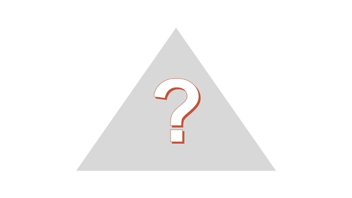
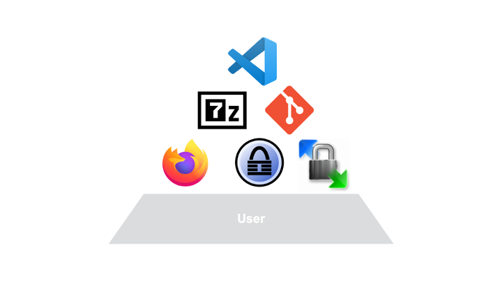
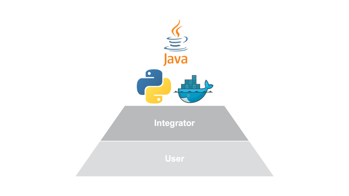
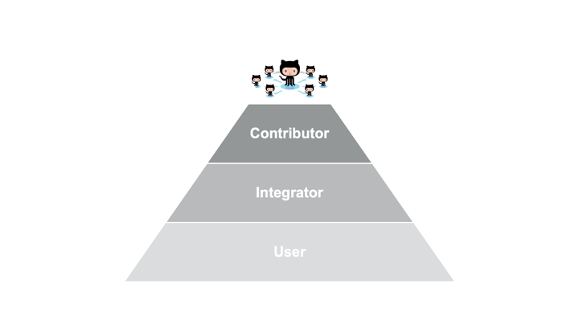
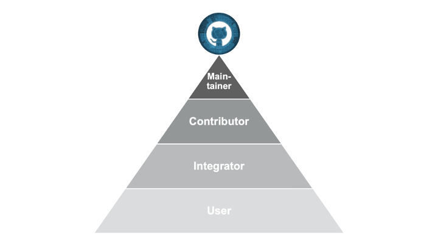
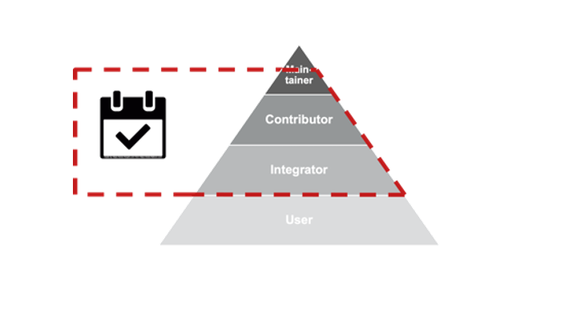

<!--
author:   René Führer

email:    rene.fuehrer@generali.com

version:  1.0.0

language: de

narrator: DE German Female

logo:     https://upload.wikimedia.org/wikipedia/commons/d/d3/TorontoMusicGarden10-TensorFlow.jpg

comment:  Open Source Awareness.

script:   https://cdnjs.cloudflare.com/ajax/libs/echarts/4.1.0/echarts-en.min.js

import:  https://raw.githubusercontent.com/liaScript/tensorflowjs_template/master/README.md

-->

# Open Source Awareness

Diese Schulung bietet einen Überblick über die Nutzung und Bereitstellung von Open Source bei der Generali Deutschland AG.

Die Schulung wurde ursprünglich für interne an Open Source interessierten Mitarbeitenden konzipiert, thematisiert aber in dden aktuellen Revisionen der Unterlagen auch stark auf das Thema Nutzung von Open Source unter Aspekten der Sicherheit und (Lizenz-)Recht.

## Blickwinkel

Lorem ipsum dolor sit amet, consetetur sadipscing elitr, sed diam nonumy eirmod tempor invidunt ut labore et dolore magna aliquyam erat, sed diam voluptua. At vero eos et accusam et justo duo dolores et ea rebum. Stet clita kasd gubergren, no sea takimata sanctus est Lorem ipsum dolor sit amet. Lorem ipsum dolor sit amet, consetetur sadipscing elitr, sed diam nonumy eirmod tempor invidunt ut labore et dolore magna aliquyam erat, sed diam voluptua. At vero eos et accusam et justo duo dolores et ea rebum. Stet clita kasd gubergren, no sea takimata sanctus est Lorem ipsum dolor sit amet. Lorem ipsum dolor sit amet, consetetur sadipscing elitr, sed diam nonumy eirmod tempor invidunt ut labore et dolore magna aliquyam erat, sed diam voluptua. At vero eos et accusam et justo duo dolores et ea rebum. Stet clita kasd gubergren, no sea takimata sanctus est Lorem ipsum dolor sit amet. 

Duis autem vel eum iriure dolor in hendrerit in vulputate velit esse molestie consequat, vel illum dolore eu feugiat nulla facilisis at vero eros et accumsan et iusto odio dignissim qui blandit praesent luptatum zzril delenit augue duis dolore te feugait nulla facilisi. Lorem ipsum dolor sit amet, consectetuer adipiscing elit, sed diam nonummy nibh euismod tincidunt ut laoreet dolore magna aliquam erat volutpat. 

Ut wisi enim ad minim veniam, quis nostrud exerci tation ullamcorper suscipit lobortis nisl ut aliquip ex ea commodo consequat. Duis autem vel eum iriure dolor in hendrerit in vulputate velit esse molestie consequat, vel illum dolore eu feugiat nulla facilisis at vero eros et accumsan et iusto odio dignissim qui blandit praesent luptatum zzril delenit augue duis dolore te feugait nulla facilisi. 

### Nutzende

Lorem ipsum dolor sit amet, consetetur sadipscing elitr, sed diam nonumy eirmod tempor invidunt ut labore et dolore magna aliquyam erat, sed diam voluptua. At vero eos et accusam et justo duo dolores et ea rebum. Stet clita kasd gubergren, no sea takimata sanctus est Lorem ipsum dolor sit amet. Lorem ipsum dolor sit amet, consetetur sadipscing elitr, sed diam nonumy eirmod tempor invidunt ut labore et dolore magna aliquyam erat, sed diam voluptua. At vero eos et accusam et justo duo dolores et ea rebum. Stet clita kasd gubergren, no sea takimata sanctus est Lorem ipsum dolor sit amet. Lorem ipsum dolor sit amet, consetetur sadipscing elitr, sed diam nonumy eirmod tempor invidunt ut labore et dolore magna aliquyam erat, sed diam voluptua. At vero eos et accusam et justo duo dolores et ea rebum. Stet clita kasd gubergren, no sea takimata sanctus est Lorem ipsum dolor sit amet. 

Duis autem vel eum iriure dolor in hendrerit in vulputate velit esse molestie consequat, vel illum dolore eu feugiat nulla facilisis at vero eros et accumsan et iusto odio dignissim qui blandit praesent luptatum zzril delenit augue duis dolore te feugait nulla facilisi. Lorem ipsum dolor sit amet, consectetuer adipiscing elit, sed diam nonummy nibh euismod tincidunt ut laoreet dolore magna aliquam erat volutpat. 

Ut wisi enim ad minim veniam, quis nostrud exerci tation ullamcorper suscipit lobortis nisl ut aliquip ex ea commodo consequat. Duis autem vel eum iriure dolor in hendrerit in vulputate velit esse molestie consequat, vel illum dolore eu feugiat nulla facilisis at vero eros et accumsan et iusto odio dignissim qui blandit praesent luptatum zzril delenit augue duis dolore te feugait nulla facilisi. 

### Integratoren

Lorem ipsum dolor sit amet, consetetur sadipscing elitr, sed diam nonumy eirmod tempor invidunt ut labore et dolore magna aliquyam erat, sed diam voluptua. At vero eos et accusam et justo duo dolores et ea rebum. Stet clita kasd gubergren, no sea takimata sanctus est Lorem ipsum dolor sit amet. Lorem ipsum dolor sit amet, consetetur sadipscing elitr, sed diam nonumy eirmod tempor invidunt ut labore et dolore magna aliquyam erat, sed diam voluptua. At vero eos et accusam et justo duo dolores et ea rebum. Stet clita kasd gubergren, no sea takimata sanctus est Lorem ipsum dolor sit amet. Lorem ipsum dolor sit amet, consetetur sadipscing elitr, sed diam nonumy eirmod tempor invidunt ut labore et dolore magna aliquyam erat, sed diam voluptua. At vero eos et accusam et justo duo dolores et ea rebum. Stet clita kasd gubergren, no sea takimata sanctus est Lorem ipsum dolor sit amet. 

Duis autem vel eum iriure dolor in hendrerit in vulputate velit esse molestie consequat, vel illum dolore eu feugiat nulla facilisis at vero eros et accumsan et iusto odio dignissim qui blandit praesent luptatum zzril delenit augue duis dolore te feugait nulla facilisi. Lorem ipsum dolor sit amet, consectetuer adipiscing elit, sed diam nonummy nibh euismod tincidunt ut laoreet dolore magna aliquam erat volutpat. 

Ut wisi enim ad minim veniam, quis nostrud exerci tation ullamcorper suscipit lobortis nisl ut aliquip ex ea commodo consequat. Duis autem vel eum iriure dolor in hendrerit in vulputate velit esse molestie consequat, vel illum dolore eu feugiat nulla facilisis at vero eros et accumsan et iusto odio dignissim qui blandit praesent luptatum zzril delenit augue duis dolore te feugait nulla facilisi. 

### Mitwirkende

Lorem ipsum dolor sit amet, consetetur sadipscing elitr, sed diam nonumy eirmod tempor invidunt ut labore et dolore magna aliquyam erat, sed diam voluptua. At vero eos et accusam et justo duo dolores et ea rebum. Stet clita kasd gubergren, no sea takimata sanctus est Lorem ipsum dolor sit amet. Lorem ipsum dolor sit amet, consetetur sadipscing elitr, sed diam nonumy eirmod tempor invidunt ut labore et dolore magna aliquyam erat, sed diam voluptua. At vero eos et accusam et justo duo dolores et ea rebum. Stet clita kasd gubergren, no sea takimata sanctus est Lorem ipsum dolor sit amet. Lorem ipsum dolor sit amet, consetetur sadipscing elitr, sed diam nonumy eirmod tempor invidunt ut labore et dolore magna aliquyam erat, sed diam voluptua. At vero eos et accusam et justo duo dolores et ea rebum. Stet clita kasd gubergren, no sea takimata sanctus est Lorem ipsum dolor sit amet.

Duis autem vel eum iriure dolor in hendrerit in vulputate velit esse molestie consequat, vel illum dolore eu feugiat nulla facilisis at vero eros et accumsan et iusto odio dignissim qui blandit praesent luptatum zzril delenit augue duis dolore te feugait nulla facilisi. Lorem ipsum dolor sit amet, consectetuer adipiscing elit, sed diam nonummy nibh euismod tincidunt ut laoreet dolore magna aliquam erat volutpat. 

Ut wisi enim ad minim veniam, quis nostrud exerci tation ullamcorper suscipit lobortis nisl ut aliquip ex ea commodo consequat. Duis autem vel eum iriure dolor in hendrerit in vulputate velit esse molestie consequat, vel illum dolore eu feugiat nulla facilisis at vero eros et accumsan et iusto odio dignissim qui blandit praesent luptatum zzril delenit augue duis dolore te feugait nulla facilisi. 

### Bereitstellende

Lorem ipsum dolor sit amet, consetetur sadipscing elitr, sed diam nonumy eirmod tempor invidunt ut labore et dolore magna aliquyam erat, sed diam voluptua. At vero eos et accusam et justo duo dolores et ea rebum. Stet clita kasd gubergren, no sea takimata sanctus est Lorem ipsum dolor sit amet. Lorem ipsum dolor sit amet, consetetur sadipscing elitr, sed diam nonumy eirmod tempor invidunt ut labore et dolore magna aliquyam erat, sed diam voluptua. At vero eos et accusam et justo duo dolores et ea rebum. Stet clita kasd gubergren, no sea takimata sanctus est Lorem ipsum dolor sit amet. Lorem ipsum dolor sit amet, consetetur sadipscing elitr, sed diam nonumy eirmod tempor invidunt ut labore et dolore magna aliquyam erat, sed diam voluptua. At vero eos et accusam et justo duo dolores et ea rebum. Stet clita kasd gubergren, no sea takimata sanctus est Lorem ipsum dolor sit amet. 

Duis autem vel eum iriure dolor in hendrerit in vulputate velit esse molestie consequat, vel illum dolore eu feugiat nulla facilisis at vero eros et accumsan et iusto odio dignissim qui blandit praesent luptatum zzril delenit augue duis dolore te feugait nulla facilisi. Lorem ipsum dolor sit amet, consectetuer adipiscing elit, sed diam nonummy nibh euismod tincidunt ut laoreet dolore magna aliquam erat volutpat. 

Ut wisi enim ad minim veniam, quis nostrud exerci tation ullamcorper suscipit lobortis nisl ut aliquip ex ea commodo consequat. Duis autem vel eum iriure dolor in hendrerit in vulputate velit esse molestie consequat, vel illum dolore eu feugiat nulla facilisis at vero eros et accumsan et iusto odio dignissim qui blandit praesent luptatum zzril delenit augue duis dolore te feugait nulla facilisi. 

### Abgrenzung

Ut wisi enim ad minim veniam, quis nostrud exerci tation ullamcorper suscipit lobortis nisl ut aliquip ex ea commodo consequat. Duis autem vel eum iriure dolor in hendrerit in vulputate velit esse molestie consequat, vel illum dolore eu feugiat nulla facilisis at vero eros et accumsan et iusto odio dignissim qui blandit praesent luptatum zzril delenit augue duis dolore te feugait nulla facilisi. 

## Quiz

### Frage 1/6

Welche dieser Antworten kann kein Open Source sein?

<!-- data-randomize data-max-trials="3" data-solution-button="1" -->
- [( )] Ein Server Design
- [( )] Linux Betriebssysteme
- [(X)] Windows Server
- [( )] Puppet

### Frage 2/6

Was bedeutet `Forking`?

<!-- data-randomize data-max-trials="1" data-solution-button="999" -->
- [( )] Ein Forking liegt vor, wenn ein Open-Source-Programm von der Gemeinschaft öffentlich weiterentwickelt wird.
- [( )] Forking ist das Stechen auf ein verkochtes Hähnchen, bis es am Essbesteck kleben bleibt.
- [( )] Forking liegt vor, wenn ein proprietäres Quellcode-Hardwaredesign als Grundlage für die Entwicklung von etwas anderem verwendet wird.
- [(X)] Forking ist, wenn Open-Source-Software zu etwas anderem entwickelt wird.

### Frage 3/6

Welche der folgenden Aussagen trifft auf GitHub nicht zu?

<!-- data-randomize data-max-trials="1" data-solution-button="999" -->
- [(X)] Ein Online-Marktplatz, auf dem Unternehmen proprietäre Software testen und dann kaufen können
- [( )] Ein Ort, an dem Unternehmen Software finden und ins Haus holen können
- [( )] Ein Repository für Open-Source-Software
- [( )] Eine Website, die Automatisierungsskripte anbietet

### Frage 4/6

What is `OCP`?

<!-- data-randomize data-max-trials="1" data-solution-button="999" -->
- [( )] Operational Computer Portfolio
- [( )] Die von IBM angebotene Produktfamilie für reine Linux-Mainframes
- [(X)] Eine Initiative zur Entwicklung von Open-Source-Servern und Rechenzentren
- [( )] Onerous Corporate Policies

### Frage 5/6

Welches der folgenden Softwareprodukte wird von Red Hat nicht angeboten?

<!-- data-randomize data-max-trials="1" data-solution-button="999" -->
- [( )] Ein Linux-Betriebssystem
- [(X)] Oracle-Datenbankanwendungen
- [( )] Software für die Konfigurationsverwaltung
- [( )] OpenStack-Verwaltungstools

### Frage 6/6

Was bedeuten die Open-Source-Terminologie "Upstream" und "Downstream" in der Entwicklung?

<!-- data-randomize data-max-trials="1" data-solution-button="999" -->
- [(X)] Upstream bezieht sich auf die Entwicklung durch diejenigen, die einen Quellcode oder eine Software erstellt oder gepflegt haben; Downstream ist die Entwicklung durch Unternehmen, die den Quellcode oder die Software geforkt haben und Support und Dienstleistungen für diese Software/den Quellcode anbieten.
- [( )] Upstream bezieht sich auf die Entwicklung durch erfahrene Mitglieder des Entwicklungsteams; Downstream bezieht sich auf die Entwicklung durch Junior- und andere rangniedrigere Entwickler.
- [( )] Upstream bezieht sich auf die Entwicklung durch ein Unternehmen, das den Quellcode oder die Software geforkt hat und Support und Dienstleistungen für diese Software/den Quellcode anbietet; Downstream ist die Entwicklung durch diejenigen, die den Quellcode oder die Software erstellt oder gepflegt haben.
- [( )] Upstream ist der Anfang eines Flusses; Downstream ist weiter flussabwärts.

## Abschluss

